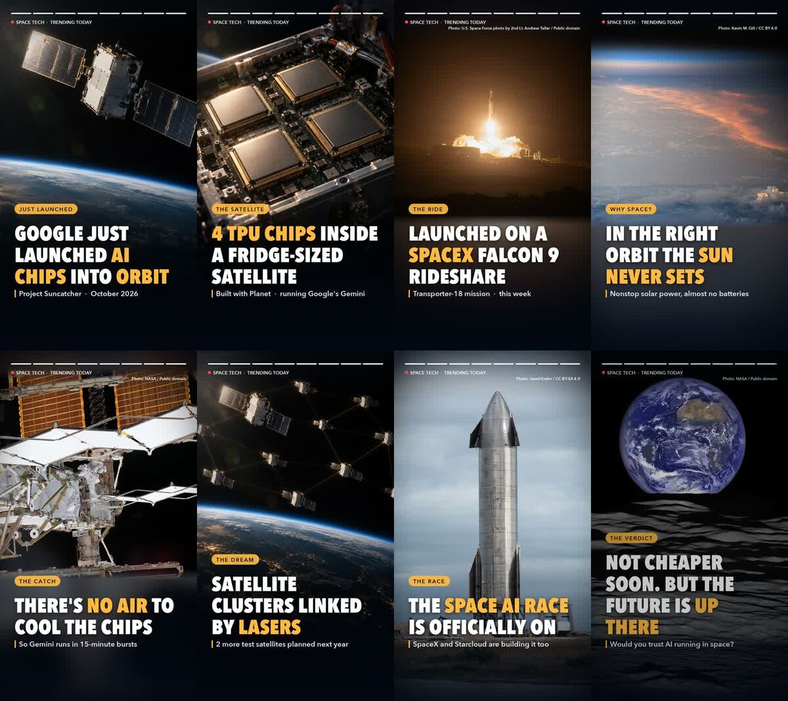

# trending-motion-video

A [Claude Code](https://docs.claude.com/en/docs/claude-code/overview) skill that turns *"what's trending today?"* into a finished, ready-to-post vertical video for **TikTok, Instagram Reels and YouTube Shorts**.

One sentence in, one MP4 out: researched and fact-checked story, real photos where good ones exist, AI images for the rest, word-by-word animated captions, a neural voiceover, and an original soundtrack with sound effects. All the audio is generated in code, so there is nothing to license and nothing for Content ID to flag.



<sub>Example: the 45-second "Project Suncatcher" short made with this skill. Scenes 3, 4, 5, 7 and 8 are real photos (credits [below](#example-photo-credits)); scenes 1, 2 and 6 were generated with Codex.</sub>

---

## Quick start

```sh
npx skills add kakha13/skills          # installs the whole collection
pip install edge-tts pillow numpy scipy
brew install ffmpeg librsvg            # librsvg is only needed for the Claude image fallback
npm i -g @openai/codex && codex login  # optional but recommended: makes the AI images
```

Then just ask Claude Code:

```
research a popular topic for today and make a motion video with images and good captions
```

or name your own topic:

```
make a 30 second reel about the James Webb telescope's newest discovery, female voice, uplifting music
```

Claude asks you once before downloading any photos, then delivers the MP4, a scene list, the photo credits for your post caption, and the sources it used.

## What happens under the hood

```
 research ──► storyboard.json ──► images ──► voiceover ──► render ──► QA ──► MP4
 (2+ sources)  (8 scenes)          │          (edge-tts)    (1080x1920)  (frames,
                                   │                                     loudness)
                                   ▼
                 1. real photos   (Wikimedia Commons, NASA, Openverse; PD / CC0 / CC BY / CC BY-SA)
                 2. Codex CLI     (only scenes with no good real photo)
                 3. Claude        (only scenes Codex couldn't make: SVG -> PNG)
```

1. **Research.** Finds a story that is trending today, visual, and full of concrete facts. Every on-screen fact is checked against at least two sources. Shaky details get softened ("this week" instead of a date it can't confirm) and flagged to you.
2. **Storyboard.** Writes 7-9 scenes with a proven short-form arc: hook, what happened, why it matters, the catch, the big vision, the stakes, and a closing question that invites comments.
3. **Images, in strict order:**
   - **Real photos first.** Searches free, reusable sources and keeps only licenses that allow commercial reuse and editing. Claude looks at every candidate, because titles lie (a "TPU chip" search returns plastic bike tubes). It accepts a photo only if it clearly shows the scene's subject and is sharp and watermark-free.
   - **Codex second.** Generates the gaps. The first image anchors the style of the rest, so a mixed set still looks like one series.
   - **Claude last.** If Codex isn't installed or fails, Claude draws the scene itself as an SVG illustration, converted to PNG.
4. **Voiceover.** Free Microsoft neural voices via edge-tts. Each scene lasts as long as its line.
5. **Render.** Slow zoom-and-pan motion, crossfades with a light flash, captions that pop in word by word with highlighted key phrases, a story-style progress bar, and photo credits on screen.
6. **Sound.** Original synthwave-style music that follows the story (beat drops at the facts, breaks down at "the catch", lifts at "the vision"), plus caption pops, whooshes, and a themed effect per scene (radio beeps, rocket rumble, laser zaps, ...). The music drops under the voice.
7. **QA.** Contact sheets of the images and frames plus a loudness check, reviewed before you get the file.

## Requirements

| Need | Why | Install |
|---|---|---|
| `python3` with Pillow, NumPy, SciPy | rendering, music, SFX | `pip install pillow numpy scipy` |
| `ffmpeg` / `ffprobe` | encoding, audio decoding | `brew install ffmpeg` |
| `edge-tts` | voiceover | `pip install edge-tts` |
| Codex CLI (logged in) | AI images (2nd choice) | `npm i -g @openai/codex` |
| `rsvg-convert` (or cairosvg, ImageMagick, Chrome) | Claude image fallback (3rd choice) | `brew install librsvg` |

Works on macOS and Linux. Fonts: Avenir Next Condensed Heavy on macOS, falling back to Impact, then DejaVu.

## The storyboard

Everything is driven by one `storyboard.json` in the project folder. See the full example in [`references/storyboard.example.json`](./references/storyboard.example.json).

```json
{
  "output": "my_video.mp4",
  "brand": "Space Tech  ·  Trending Today",
  "accent": "#FFB840",
  "style": "photorealistic cinematic documentary space photograph, ...",
  "voice": "en-US-AndrewNeural",
  "rate": "+6%",
  "music": { "mood": "epic", "bpm": 100, "level": 0.5 },
  "scenes": [
    {
      "image_query": "Falcon 9 launch",
      "image_prompt": "a Falcon 9 style rocket lifting off at dawn, unbranded",
      "kicker": "The ride",
      "main": "Launched on a *SpaceX* Falcon 9 rideshare",
      "sub": "Transporter-18 mission  ·  this week",
      "vo": "It rode to space this week, on a SpaceX Falcon 9.",
      "sfx": "rocket"
    }
  ]
}
```

| Field | Meaning |
|---|---|
| `brand`, `accent` | small label at the top; highlight color for key words and labels |
| `style` | one art direction shared by every generated image |
| `voice`, `rate` | any [edge-tts voice](https://github.com/rany2/edge-tts) (`en-US-AriaNeural`, `en-GB-RyanNeural`, ...) and speed |
| `music` | `mood`: `epic`, `uplifting` or `dark`; `bpm`; `level` (volume under the voice) |
| `sfx_level` | overall sound-effects volume (default 1.0) |
| scene `image_query` | 2-4 word search for a real photo |
| scene `image_prompt` | subject for the AI fallback (no text, no real logos) |
| scene `image_source` | filled in when a real photo is chosen: `url`, `license`, `credit`, `page` |
| scene `kicker` / `main` / `sub` | label, headline (wrap key phrases in `*asterisks*`), supporting line |
| scene `vo` | the spoken line; the scene's length follows it |
| scene `sfx` | `telemetry`, `compute`, `rocket`, `sparkle`, `alarm`, `lasers`, `flyby`, `impact`, `glitch`, `typing`, `heartbeat` |
| scene `music` | `breakdown` (beat drops out) or `lift` (riser + impact + melody) |
| scene `dur`, `kb`, `pan` | force a duration; zoom `in`/`out`; pan `-1`/`0`/`1` |

## Scripts

Every script takes the project's `storyboard.json`, skips work that already exists, and can be re-run safely.

| Script | What it does |
|---|---|
| `fetch_images.py search` | searches Commons, NASA and Openverse per scene, filters licenses, ranks by size |
| `fetch_images.py thumbs` | numbered thumbnail sheets per scene for visual review |
| `fetch_images.py fetch` | downloads chosen photos, fits them to portrait, writes `credits.md` |
| `gen_images.py` | Codex image for each scene still missing one; `--only 5` to redo one |
| `svg_to_png.py` | rasterizes Claude-drawn `images/NN.svg` (the Claude fallback) |
| `voiceover.py` | one edge-tts clip per scene; `--force` / `--only 3` to redo |
| `render.py` | the MP4; `--preview` renders 3 stills in seconds |
| `check.py` | QA sheets (`qa_images.jpg`, `qa_frames.jpg`) and loudness |
| `music.py` / `sfx.py` | soundtrack and effect engines; `python3 music.py uplifting` previews the music alone |

Manual run, if you want to drive it yourself:

```sh
S=~/.claude/skills/trending-motion-video/scripts
python3 $S/fetch_images.py search storyboard.json
python3 $S/fetch_images.py thumbs storyboard.json   # look at candidates/NN_sheet.jpg
# add "image_source" to the scenes you like, then:
python3 $S/fetch_images.py fetch storyboard.json
python3 $S/gen_images.py storyboard.json            # exit code 2 = some scenes need the Claude fallback
python3 $S/voiceover.py storyboard.json
python3 $S/render.py storyboard.json --preview
python3 $S/render.py storyboard.json
python3 $S/check.py storyboard.json
```

## Licensing and safety

- **Photos:** only public domain, CC0, CC BY and CC BY-SA are accepted. NC and ND licenses, stock sites and news-agency photos are never used. Credits appear on screen and in `credits.md` for your post caption. CC BY-SA is "share-alike"; if that's a concern for a monetized post, swap that scene for a generated one.
- **Downloads:** Claude asks before downloading anything.
- **Audio:** music and effects are synthesized from scratch: no samples, no attribution, no Content ID claims.
- **Facts:** checked in 2+ sources; anything uncertain is softened on screen and called out in the summary.

## Troubleshooting

| Problem | Fix |
|---|---|
| "model is not supported when using Codex with a ChatGPT account" | handled: `gen_images.py` switches to a supported model from `~/.codex/models_cache.json`, or set `CODEX_IMAGE_MODEL` |
| Codex not installed or failing | handled: the scene goes to the Claude fallback (`needs_claude.json`) |
| An image looks wrong | edit that scene's `image_prompt`, then `gen_images.py --only N` |
| Captions hidden by app buttons | they're bottom-anchored at y=1560 to avoid this; keep `main` to 9 words or fewer |
| Voice too fast or slow | change `rate`, then `voiceover.py --force` |
| Music too loud | lower `music.level` (e.g. 0.35) |

## Example photo credits

- Scene 3: U.S. Space Force photo by 2nd Lt. Andrew Taller, Public domain ([source](https://commons.wikimedia.org/wiki/File:Vandenberg_Launches_Starlink_Mission_Aboard_Falcon_9_Rocket_(9635197).jpg))
- Scene 4: Kevin M. Gill, CC BY 4.0 ([source](https://commons.wikimedia.org/wiki/File:Clouds_at_Day-Night_Terminator_-_ISS_-_July_7,_2026_(55400202099).jpg))
- Scene 5: NASA, Public domain ([source](https://commons.wikimedia.org/wiki/File:ISS-64_Hopkins_and_Glover_dwarfed_by_solar_arrays.jpg))
- Scene 7: Jared Krahn, CC BY-SA 4.0 ([source](https://commons.wikimedia.org/wiki/File:Starship_SN9_Launch_Pad.jpg))
- Scene 8: NASA / Goddard Space Flight Center / Arizona State University, Public domain ([source](https://commons.wikimedia.org/wiki/File:Earthrise_over_Compton_crater_-LRO_full_res.jpg))

## License

MIT, like the rest of [kakha13/skills](https://github.com/kakha13/skills).
